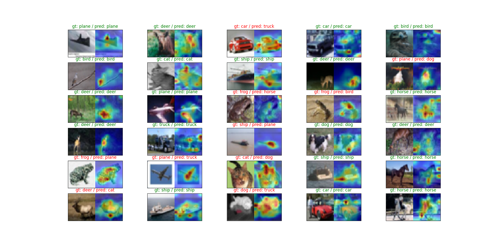

# Vision Transformer (ViT) Implementation and Video Attention Visualization



<video controls src="attention.mp4" title="Title"></video>

This project implements a Vision Transformer (ViT) model from scratch and includes a script for visualizing attention on video frames. The implementation is based on the original ViT paper and inspired by various educational resources.

## Project Structure

- `vision_transformers.py`: Contains the implementation of the ViT model.
- `run.py`: Script for applying attention visualization to video frames using a trained ViT model.

## Features

- Vision Transformer (ViT) implementation from scratch
- Training script for the ViT model on image classification tasks
- Video processing script to visualize attention maps on video frames

## Usage

1. Train the ViT model:
   ```
   python vision_transformer.py
   ```

2. Visualize attention on a video:
   ```
   python video_attention_visualization.py
   ```

   Make sure to update the `experiment_name` and `input_video_path` in the script before running.

## Requirements

- PyTorch
- torchvision
- numpy
- matplotlib
- OpenCV (cv2)

## Credits

This project is inspired by and adapted from the following resources:

- [Implementing Vision Transformer (ViT) from Scratch](https://towardsdatascience.com/implementing-vision-transformer-vit-from-scratch-3e192c6155f0) by Tin Nguyen
  - This article provided the foundation for our ViT implementation and helped structure the code.

- [Let's build GPT: from scratch, in code, spelled out](https://www.youtube.com/watch?v=kCc8FmEb1nY) by Andrej Karpathy
  - While this video focuses on GPT, it offers valuable insights into transformer architecture and implementation details that were helpful in understanding and adapting the ViT model.

Additional

- [Tiger Video by Shailesh Kashid on Pexels](https://www.pexels.com/video/white-tigers-captive-in-the-zoo-6035932/)


## Additional Resources

For a deeper understanding of Vision Transformers and attention mechanisms, we recommend the following:

1. [Attention Is All You Need](https://arxiv.org/abs/1706.03762) - The paper introducing the transformer architecture

## Contact

If you have any questions or feedback, please open an issue in this repository.